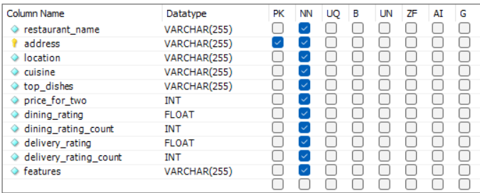

# Project 2 - Zomato Chennai Restaurants EDA

## Project Overview:

This data analysis project explores the dining preferences and trends of Chennai residents using data from Zomato, a popular food delivery app that also offers detailed information about restaurants, including menus, reviews, and ratings. The goal is to identify patterns in Chennai's food scene by looking at aspects like prices, cuisine types, top-selling dishes, and user ratings.

The dataset, sourced from [Kaggle, 2020](https://www.kaggle.com/datasets/phiitm/chennai-zomato-restaurants-data/data), includes vital information such as the cost for two people, the types of cuisines each restaurant offers, top-selling dishes, Zomato ratings, and the number of users that contribute to those ratings. For this project we are only looking at restaurants that provide both dining and delivery options.


- The project is aiming to enhance Zomato's market presence and user engagement in specific areas of Chennai.
- Identify popular dining areas and neighborhoods based on restaurant concentrations and user ratings.
- Provide insights into the intersection of local incomes, spending habits, and restaurant choices in Chennai.
- Highlight renowned restaurants and culinary icons in Chennai, focusing on their specialties and popularity.
  
## Content
1. [Data Exploration and Cleaning](https://github.com/JeevanGaneshV/Portfolio-of-Jeevan-Ganesh/blob/main/Project%202%20-%20Zomato%20Chennai%20Restaurants%20EDA/Zomato%20Chennai%20Restaurants%20EDA.md#data-exploration-and-cleaning)
2. [Data Analysis](https://github.com/JeevanGaneshV/Portfolio-of-Jeevan-Ganesh/blob/main/Project%202%20-%20Zomato%20Chennai%20Restaurants%20EDA/Zomato%20Chennai%20Restaurants%20EDA.md#data-analysis)
   
   2.1. [Analysis of Chennai Locations with the Highest Number of Restaurants](https://github.com/JeevanGaneshV/Portfolio-of-Jeevan-Ganesh/blob/main/Project%202%20-%20Zomato%20Chennai%20Restaurants%20EDA/Zomato%20Chennai%20Restaurants%20EDA.md#21-analysis-of-chennai-locations-with-the-highest-number-of-restaurants)

   2.2. [Top 10 Highly Rated Restaurant Locations in Chennai](https://github.com/JeevanGaneshV/Portfolio-of-Jeevan-Ganesh/blob/main/Project%202%20-%20Zomato%20Chennai%20Restaurants%20EDA/Zomato%20Chennai%20Restaurants%20EDA.md#22-top-10-highly-rated-restaurant-locations-in-chennai)
   
   2.3. [Restaurants with the Highest Number of 4 Star Ratings or Above](https://github.com/JeevanGaneshV/Portfolio-of-Jeevan-Ganesh/blob/main/Project%202%20-%20Zomato%20Chennai%20Restaurants%20EDA/Zomato%20Chennai%20Restaurants%20EDA.md#23-restaurants-with-the-highest-number-of-4star-ratings-or-above)
   
   2.4. [Top 10 Budget Friendly Locations in Chennai with Restaurants Rated 3.6 Stars or Above](https://github.com/JeevanGaneshV/Portfolio-of-Jeevan-Ganesh/blob/main/Project%202%20-%20Zomato%20Chennai%20Restaurants%20EDA/Zomato%20Chennai%20Restaurants%20EDA.md#24-top-10-budgetfriendly-locations-in-chennai-with-restaurants-rated-36-stars-or-above)
   
   2.5. [Top 10 Affordable Restaurants in Chennai with Ratings of 3.6 Stars or Above](https://github.com/JeevanGaneshV/Portfolio-of-Jeevan-Ganesh/blob/main/Project%202%20-%20Zomato%20Chennai%20Restaurants%20EDA/Zomato%20Chennai%20Restaurants%20EDA.md#25-top-10-affordable-restaurants-in-chennai-with-ratings-of-36-stars-or-above)
   
   2.6. [Areas in Chennai with the Expensive Restaurants](https://github.com/JeevanGaneshV/Portfolio-of-Jeevan-Ganesh/blob/main/Project%202%20-%20Zomato%20Chennai%20Restaurants%20EDA/Zomato%20Chennai%20Restaurants%20EDA.md#26-areas-in-chennai-with-the-expensive-restaurants)
   
   2.7. [Top 20 Restaurants with the Most Branches in Chennai](https://github.com/JeevanGaneshV/Portfolio-of-Jeevan-Ganesh/blob/main/Project%202%20-%20Zomato%20Chennai%20Restaurants%20EDA/Zomato%20Chennai%20Restaurants%20EDA.md#27-top-20-restaurants-with-the-most-branches-in-chennai)
   
   2.8. [Top 10 Locations in Chennai with Vegetarian Only Restaurants](https://github.com/JeevanGaneshV/Portfolio-of-Jeevan-Ganesh/blob/main/Project%202%20-%20Zomato%20Chennai%20Restaurants%20EDA/Zomato%20Chennai%20Restaurants%20EDA.md#28-top-10locations-in-chennai-with-vegetarian-only-restaurants)
   
   2.9. [Top 15 Popular Restaurants in Chennai with Ratings Above 4.2](https://github.com/JeevanGaneshV/Portfolio-of-Jeevan-Ganesh/blob/main/Project%202%20-%20Zomato%20Chennai%20Restaurants%20EDA/Zomato%20Chennai%20Restaurants%20EDA.md#29-top-15-popular-restaurants-in-chennai-with-ratings-above-42)
   
   2.10. [Popular Cuisines in Chennai](https://github.com/JeevanGaneshV/Portfolio-of-Jeevan-Ganesh/blob/main/Project%202%20-%20Zomato%20Chennai%20Restaurants%20EDA/Zomato%20Chennai%20Restaurants%20EDA.md#210-popular-cuisines-in-chennai)
   
   2.11. [Favorite Cuisines among Chennai Residents](https://github.com/JeevanGaneshV/Portfolio-of-Jeevan-Ganesh/blob/main/Project%202%20-%20Zomato%20Chennai%20Restaurants%20EDA/Zomato%20Chennai%20Restaurants%20EDA.md#211-favorite-cuisines-among-chennai-residents)
   
   2.12. [Price Distribution of Restaurants Across Chennai Areas (Above Rs. 500 and Below Rs. 400 for Two)](https://github.com/JeevanGaneshV/Portfolio-of-Jeevan-Ganesh/blob/main/Project%202%20-%20Zomato%20Chennai%20Restaurants%20EDA/Zomato%20Chennai%20Restaurants%20EDA.md#212-price-distribution-of-restaurants-across-chennai-areas--rs-500-for-two)
   
3. [Conclusions](https://github.com/JeevanGaneshV/Portfolio-of-Jeevan-Ganesh/blob/main/Project%202%20-%20Zomato%20Chennai%20Restaurants%20EDA/Zomato%20Chennai%20Restaurants%20EDA.md#conclusions)
   
## Data Exploration and Cleaning

**SQL Data Table Columns**




- Checking for any duplicate rows by using address as primary key.
 ```sql
SELECT 
	address, 
	COUNT(*) AS count
FROM world.zomato
GROUP BY
	address
HAVING count>1;
```

- Removing unused columns such as zomato_url
 ```sql
ALTER TABLE world.zomato
DROP COLUMN zomato_url;
```


- Formatting strings to remove brackets from cuisine, top_dishes and features
```sql
UPDATE world.zomato
SET cuisine = REPLACE(REPLACE(REPLACE(cuisine, '[', ''), ']', ''), ', ', ', ')
WHERE address IS NOT NULL;
```
```sql
UPDATE world.zomato
SET top_dishes = REPLACE(REPLACE(REPLACE(top_dishes, '[', ''), ']', ''), ', ', ', ')
WHERE address IS NOT NULL;
```
```sql
UPDATE world.zomato
SET features = REPLACE(REPLACE(REPLACE(features, '[', ''), ']', ''), ', ', ', ')
WHERE address IS NOT NULL;
```

- Exporting the cleaned dataset
```sql
SELECT * 
FROM world.zomato
INTO OUTFILE 'C:/ProgramData/MySQL/MySQL Server 8.0/Uploads/cleaned_zomato_dataset.csv'     
FIELDS TERMINATED BY ','    
OPTIONALLY ENCLOSED BY '"'    
LINES TERMINATED BY '\r\n';  
```

## Data Analysis

**Observations are made in bullet points**

#### 2.1. **Analysis of Chennai Locations with the Highest Number of Restaurants**


- Porur, Velachery, Anna Nagar East, Ambattur, and T. Nagar having more than **100** restaurants each highlight them as popular dining spots in Chennai. This indicates a strong preference for dining out, likely due to the concentration of both residential areas and commercial activities in these locations.

#### 2.2. **Top 10 Highly Rated Restaurant Locations in Chennai**


- Anna Nagar East, Nungambakkam, and Adyar are popular dining areas in Chennai with over 15 highly rated restaurants each, catering to residents who appreciate good food and city life. (We applied filters to ensure that the data includes ratings from over 200 users for both delivery and dining experiences, ensuring reliability)

#### 2.3. **Restaurants with the Highest Number of 4 Star Ratings or Above**


- Domino's Pizza, Dindigul Thalappakatti, and Sangeetha Veg Restaurant are highly respected in Chennai because they have the most restaurant locations rated 4 stars or higher. Domino's Pizza is well-liked for its reliable service and widespread delivery options, which Chennai residents prefer for convenient pizza choices. Dindigul Thalappakatti is known for its authentic South Indian food, especially its famous biryanis, which are very popular among locals who enjoy rich, traditional dishes. Sangeetha Veg Restaurant is famous for its wide variety of vegetarian dishes and consistent quality, serving Chennai's large vegetarian population well. These restaurants not only have satisfied customers but also reflect Chennai's diverse culinary tastes, highlighting a commitment to high standards and genuine flavors in the city's dining scene. (We applied filters to ensure that the data includes ratings from over 200 users for both delivery and dining experiences, ensuring reliability)

#### 2.4. **Top 10 Budget Friendly Locations in Chennai with Restaurants Rated 3.6 Stars or Above**


- Anna Nagar East, Adyar, and Nanganallur are popular in Chennai for affordable dining because they have a variety of restaurants that offer good food at reasonable prices. Anna Nagar East is a family friendly area, Adyar mixes homes with businesses. These areas are top choices for budget conscious diners looking for enjoyable meals without spending too much. (We applied filters to ensure that the data includes ratings from over 200 users for both delivery and dining experiences, ensuring reliability)

#### 2.5. **Top 10 Affordable Restaurants in Chennai with Ratings of 3.6 Stars or Above**


- ID, Chai Kings, and The Kati Roll Shop are among Chennai's top 10 affordable restaurants where the food for two cost between Rs. 100 to 300. (We applied filters to ensure that the data includes ratings from over 200 users for both delivery and dining experiences, ensuring reliability)

#### 2.6. **Areas in Chennai with the Expensive Restaurants**


- Nungambakkam, Alwarpet, and Adyar feature expensive restaurants in Chennai, indicating a preference for luxury dining. These areas likely have residents with higher incomes, including professionals and possibly celebrities, who value luxurious dining experiences. The presence of fancy restaurants reflects the demand for premium food and elegant atmospheres in these neighborhoods.

#### 2.7. **Top 20 Restaurants with the Most Branches in Chennai**


- Dominos Pizza leads with 61 branches in Chennai, followed by Ibaco with 36 and Meat and Eat with 35. This shows that these restaurants are popular and people in Chennai enjoy their pizzas, ice creams, and non-vegetarian options. Their wide presence suggests they are efficient in profit making and strategically located.

#### 2.8. **Top 10 Locations in Chennai with Vegetarian Only Restaurants**


- The abundance of vegetarian-only restaurants in Anna Nagar East, T. Nagar, and Velachery suggests these areas have a strong preference for vegetarian food. It indicates a significant vegetarian population and a high demand for vegetarian options due to cultural and health reasons.

#### 2.9. **Top 15 Popular Restaurants in Chennai with Ratings Above 4.2**


- Sangeetha Veg Restaurant is the most popular dining spot in Chennai, with over 60,000 user reviews. Its widespread appeal and high number of reviews reflect its excellent reputation and consistent support from both residents and visitors.

#### 2.10. **Popular Cuisines in Chennai**


- The popular cuisines in Chennai—Chinese, North Indian, Fast Food, South Indian, and Biryani show the varied tastes and preferences among its residents.

#### 2.11. **Favorite Cuisines among Chennai Residents**


- North Indian cuisine is favored by Chennai residents, showcasing a preference for its rich flavors, diverse dishes like paneer butter masala, naan, and other popular chat items.

#### 2.12. **Price Distribution of Restaurants Across Chennai Areas (> Rs. 500 for Two)**


**Price Distribution of Restaurants Across Chennai Areas (< Rs. 400 for Two)**

 
- In Chennai, where dining for two costs more than Rs. 500, we see income differences across areas. Kanathur and Santhome are pricier, suggesting residents there have higher incomes and enjoy luxury dining. Meanwhile, Abhiramapuram and Sowcarpet are cheaper where dining for two costs less than Rs. 400, indicating a different economic group with more affordable dining choices. This data helps us understand Chennai's economic diversity by showing how restaurant prices align with local incomes and spending habits.


### **Conclusions**

-  Focus marketing efforts on popular dining hubs like Porur, Velachery, and T. Nagar to increase user engagement and app usage in these areas. Promote restaurants with diverse cuisine options to attract a wide range of users.
-   Identify emerging areas with growing dining scenes, such as Anna Nagar East and Nanganallur, as potential hotspots for new restaurant openings. Provide incentives for restaurants to list on Zomato in these areas to expand the platform's coverage and offerings.
-   Encourage user reviews to build trust and credibility among users. Highlight top-rated restaurants in popular categories like Domino's Pizza, Dindigul Thalappakatti, and Sangeetha Veg Restaurant to enhance visibility and attract more users.
-   Collaborate with vegetarian restaurants in areas like Anna Nagar East and T. Nagar to expand vegetarian offerings on Zomato. Promote these restaurants prominently to cater to the city's significant vegetarian population.
-   Use insights into economic disparities and dining preferences across different areas to guide business decisions and strategic partnerships. Provide data driven recommendations to restaurants on pricing strategies and menu offerings based on local market demands.

  


